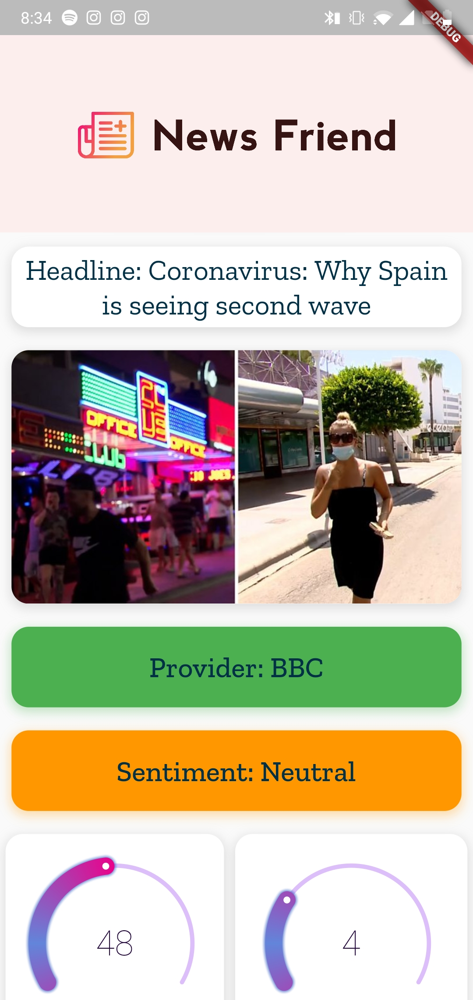
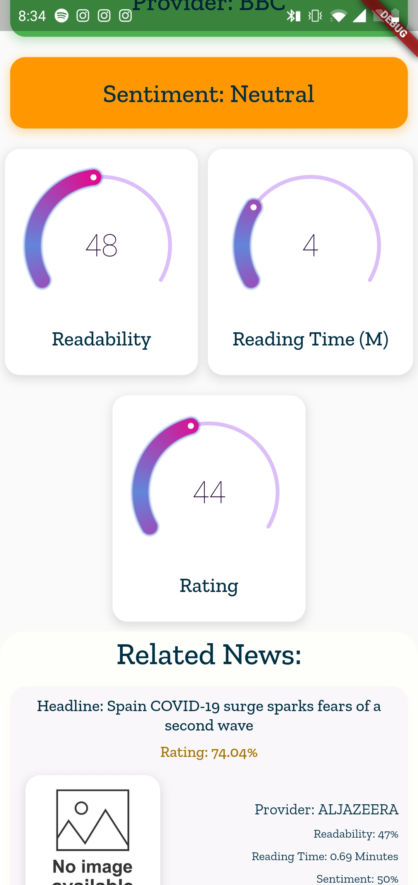

# NewsFriend

A do-it-all News Helper widget to tell you all you need to know about a news link!

In today's day and age, people spam-share news to all their contacts often without reading the entire news article or without veryfiying if the article is the best version of the news beign shared.

The NewsFriend app attempts to address that by to pre-filtering a news article before reading it. To use the app, a user simply pastes a url into the app search bar, or shares the url via the phone's share button. The app will find then analyze the news article shared and find the best alternative articles for the given news. Furthermore, the app will rank your article based on readability/complexity of language, reading time/ article length, and the article's sentiment. After doing this analysis on all the alternative articles, the algorithm will give your orignal article a rating and suggest the better alternative articles on the same news for you to read!

# Features
-> Ranking of news source (Compare against top 10 alternative news providers for the same piece of news via webscrapping)  
-> Readability score (how easy is the language to read) 
-> Reading time (how long will it take you to read the article) 
-> Trigger-ibility analysis (Sentiment analysis of news article and comparing it to the sentiment analysis performed on other news sources to see if this article is trying to generate turmoil)   
-> reccomendation for 5 other articles that are easier to read/shorter/offer more neutral emotions (customizable filters) 
-> Digestable dashboard! 

# Packaging
-> Have a server perform a lot of computations and offer results as an API (Using FastAPI & Heroku right now)  
-> Mobile app built on Flutter to easily deploy to IOS, Android, and possibly as a webapp too  

Checkout the API here: https://github.com/SaralTayal123/NewsFriendPublicAPI

# Screenshots
### Landing page

### Processing page

### Results page

### Results page(scrolled down)

